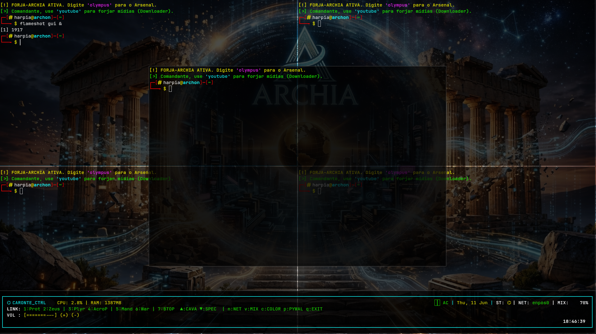

# Meu DWL Personalizado 🪟

Esta é a minha build customizada do **dwl** (Dynamic Window Manager para Wayland), focada em um visual moderno, layouts inteligentes e máxima produtividade dentro do ecossistema Archia.

<p align="center">
  
</p>

> 🖥️ **Nota sobre a tecla modificadora:** A tecla principal (`MODKEY`) configurada nesta build é a tecla **Super** (também conhecida como tecla Windows).

---

## ⌨️ Atalhos Principais (Keybindings)

### 🖥️ Programas e Terminais

| Atalho | Ação |
| :--- | :--- |
| `Super + Enter` | Abre o terminal padrão (`Kitty`) |
| `F1` | Abre a Sanfona (Terminal de Rodapé executando ) |
| `Super + D` | Abre o menu de aplicativos (`Fuzzel`) |


### 🪟 Gerenciamento de Janelas (Ações Rápidas)

| Atalho | Ação |
| :--- | :--- |
| `Super + Q` | Fecha a janela focada imediatamente |
| `Super + J` / `K` | Navega o foco entre as janelas |
| `Super + Space` | Alterna a janela entre modo Mosaico e o próximo layout |
| `Super + Shift + Space` | Alterna a janela atual entre modo Flutuante ou Lado a Lado |

### 📐 Controle de Layout e Avançado

| Atalho | Ação |
| :--- | :--- |
| `Super + H` / `L` | Encolhe ou expande a área principal (Master) |
| `Super + Seta para Cima` / `Baixo` | Aumenta ou diminui o número de janelas no Master |
| `Super + Shift + J` / `K` | Alterna o posicionamento (Zoom) da janela atual na pilha |
| `Ctrl + Alt + Backspace` | Força a derrubada do servidor gráfico se travar |

### 🎛️ Sistema e Workspaces

| Atalho | Ação |
| :--- | :--- |
| `Super + [1 até 8]` | Alterna entre as áreas de trabalho (Tags ajustadas para 8) |
| `Super + Shift + [1-8]` | Transfere a janela ativa para aquela área de trabalho |
| `Super + Ctrl + [1-8]` | Combina a exibição da área atual com a selecionada |
| `Super + Shift + E` | Encerra o DWL com segurança (Sair do Sistema) |

## 🛠️ Como Instalar e Compilar

### 1. Instalar as dependências

Escolha o comando de acordo com a sua distribuição Linux para instalar as ferramentas de compilação e as bibliotecas de desenvolvimento do `wlroots`:

* **Arch Linux (`pacman`):**
  ```bash
  sudo pacman -S base-devel wlroots libxkbcommon libinput
  ```

* **Fedora / RHEL (`dnf` / `yum`):**
  ```bash
  sudo dnf install make gcc wlroots-devel libxkbcommon-devel libinput-devel
  ```

* **Debian / Ubuntu (`apt`):**
  ```bash
  sudo apt install make gcc libwlroots-dev libxkbcommon-dev libinput-dev
  ```

* **openSUSE (`zypper`):**
  ```bash
  sudo zypper install make gcc wlroots-devel libxkbcommon-devel libinput-devel
  ```

### 2. Compilar e Instalar
Abra o terminal na pasta deste projeto e execute o comando abaixo para limpar builds antigas e instalar a nova versão do seu gerenciador de janelas:

```bash
sudo make clean install
```

---
## 🚀 Inicialização e Papel de Parede

Para iniciar o `dwl` executando um script de inicialização personalizado (essencial para carregar o seu papel de parede, barras e utilitários), utilize a flag `-s` no terminal:

```bash
dwl -s '~/.dwlinit' &
```

### 📝 Exemplo de Script (~/.dwlinit)

Crie o arquivo `~/.dwlinit`, dê a ele permissão de execução com `chmod +x ~/.dwlinit` e adicione o conteúdo abaixo para gerenciar o seu ambiente:

```bash
#!/bin/sh

# 1. Definir o papel de parede (Exemplo usando swaybg ou wpaperd)
swaybg -i /dwl/assets/dwldwl.png -m fill &

# 2. Iniciar a barra de status e notificações

## ⚖️ Licença (License)

# 3. Executar demais utilitários em segundo plano
# (adicione seus programas aqui)
```
📦 **DEPLOY RÁPIDO DISPONÍVEL:** Se você quer apenas instalar os arquivos de configuração rápidos para os terminais (`kitty`) e configurar o ambiente gráfico baseado em Wayland com segurança, **[CLIQUE AQUI PARA ACESSAR O GUIA SIMPLECONFIG](./simpleconfig).**


Este projeto preserva integralmente os termos de licenciamento originais definidos pelos criadores do ecossistema e suas respectivas ferramentas de base. O código-fonte permanece distribuído sob as diretrizes estabelecidas nos arquivos correspondentes:

* Licença Base do Gerenciador: `LICENSE`
* Licenças de Componentes e Derivados: `LICENSE.dwm`, `LICENSE.sway` e `LICENSE.tinywl`

*Nenhuma alteração foi realizada nos termos legais ou na propriedade intelectual dos autores originais.*

